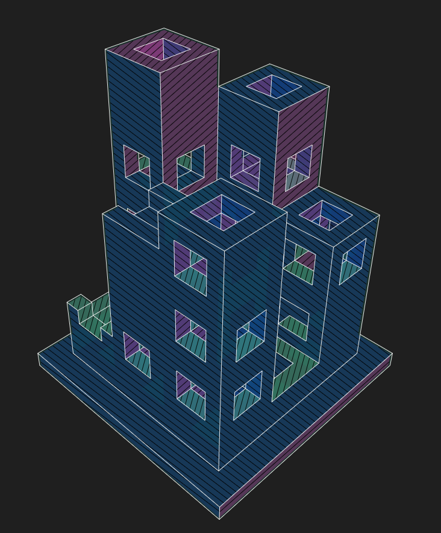
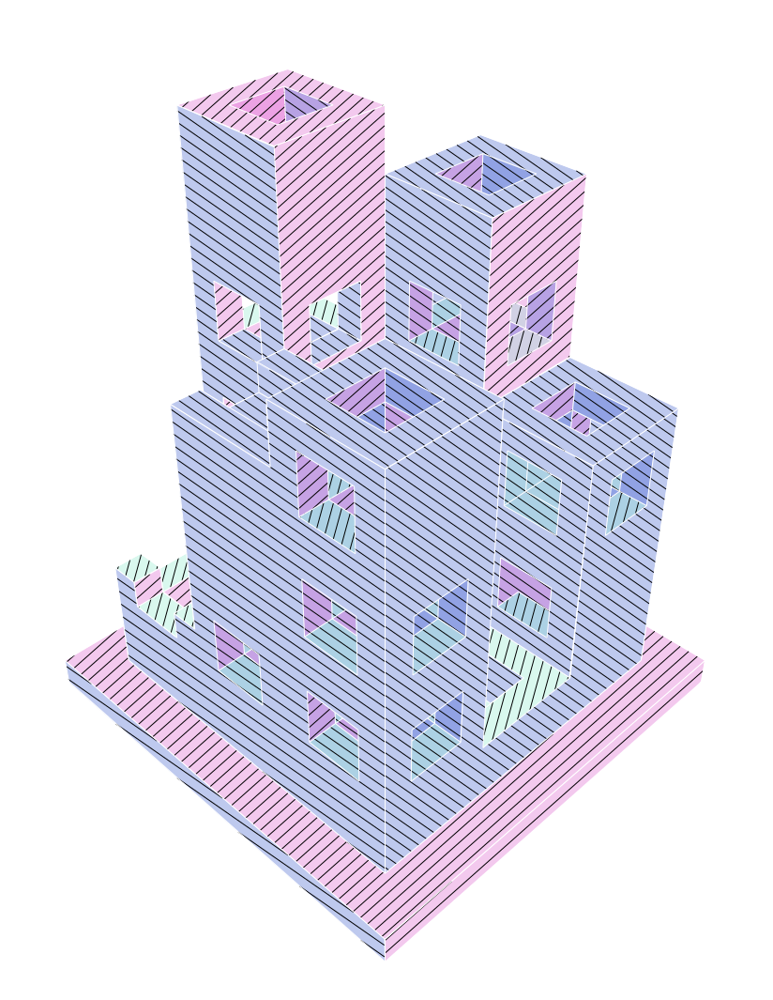

# three-plotter-renderer

[](https://opensource.org/licenses/MIT)

An SVG renderer for Three.js with hidden line removal - designed for pen plotters and laser cutters.

<p align="center">
  
  
</p>

## Quick Start

```bash
npm install github:neurofuzzy/three-plotter-renderer three
```

```javascript
import * as THREE from 'three';
import { PlotterRenderer } from 'three-plotter-renderer';

const glRenderer = new THREE.WebGLRenderer();
const plotterRenderer = new PlotterRenderer();
plotterRenderer.setSize(800, 600);
plotterRenderer.setGLRenderer(glRenderer);

// Render your scene to SVG (async to avoid blocking on complex models)
plotterRenderer.clear();
await plotterRenderer.renderGPULayers(scene, camera);

// Export
const svg = plotterRenderer.domElement.outerHTML;
```

## Features

- 🎨 **Hidden line removal** - Edge-based occlusion testing produces clean, plottable output
- 📐 **Multi-layer SVG output** - Separate layers for silhouettes, edges, and hatching
- 🖊️ **Perspective hatching** - GPU-accelerated, depth-aware hatching that converges toward vanishing points
- 🔧 **Configurable styling** - Control stroke colors, widths, and hatch spacing per-axis
- 📦 **Inkscape compatible** - Exports with proper namespace and layer structure
- 📝 **TypeScript support** - Full type definitions included

## Installation

```bash
npm install three-plotter-renderer three
# or from GitHub:
npm install github:neurofuzzy/three-plotter-renderer three
```


## Development

```bash
git clone https://github.com/neurofuzzy/three-plotter-renderer.git
cd three-plotter-renderer
npm install
npm run dev     # Start dev server
npm run build   # Build for production
npm run test    # Run tests
```

Open http://localhost:5173/ to see the primitives demo.

## How It Works

The hidden line algorithm uses a multi-pass approach for efficient edge classification and occlusion testing:

1. **Edge Extraction** - Extracts all edges from mesh geometry, tracking which faces share each edge and their normals

2. **Backface Filtering** - Removes edges where both adjacent faces are facing away from the camera

3. **Profile Detection** - Marks edges as silhouettes when they border a front-facing and back-facing face (guaranteed to be visible profile edges)

4. **Smooth Edge Filtering** - Removes edges between faces with similar normals (within configurable threshold), eliminating internal tessellation edges

5. **Intersection Splitting** - Uses spatial hashing to efficiently find edge intersections; subdivides edges at crossing points so each resulting segment has a single occlusion state

6. **Occlusion Testing** - Ray-casts from the midpoint of each edge to determine visibility; edges are hidden if the midpoint depth doesn't match the parent face

7. **GPU Hatching** - Renders normal buffer to extract regions by facing direction; generates perspective-aware hatch lines that converge toward vanishing points

## API

### PlotterRenderer

The main renderer class that generates SVG output from Three.js scenes.

```typescript
const plotterRenderer = new PlotterRenderer();

// Required setup
plotterRenderer.setSize(width, height);
plotterRenderer.setGLRenderer(glRenderer); // WebGLRenderer instance

// Layer toggles
plotterRenderer.showSilhouettes = true;  // Region fills based on normal
plotterRenderer.showEdges = true;         // Hidden line edges
plotterRenderer.showHatches = true;       // Perspective hatching

// Edge styling
plotterRenderer.edgeOptions = {
  stroke: 'white',
  strokeWidth: '1px'
};

// Hatch styling
plotterRenderer.hatchOptions = {
  stroke: 'black',
  strokeWidth: '1px',
  baseSpacing: 8,
  insetPixels: 2,    // Erode hatch boundaries
  frameBudgetMs: 16, // Yield to browser every ~16ms (60fps)
  progressCallback: (p) => console.log(`${Math.round(p*100)}%`),
  axisSettings: {
    x: { rotation: 0, spacing: 8 },
    y: { rotation: 0, spacing: 8 },
    z: { rotation: 0, spacing: 8 }
  }
};

// Render (async - returns Promise)
plotterRenderer.clear();
await plotterRenderer.renderGPULayers(scene, camera);
```

### Additional Exports

```typescript
// Hidden line computation
import { computeHiddenLinesMultiple } from 'three-plotter-renderer';
const result = computeHiddenLinesMultiple(meshes, camera, scene, options);

// GPU silhouette extraction
import { extractNormalRegions } from 'three-plotter-renderer';
const regions = extractNormalRegions(glRenderer, scene, camera, options);

// Perspective hatching
import { generatePerspectiveHatches } from 'three-plotter-renderer';
const hatches = generatePerspectiveHatches(region, camera, options);

// Path optimization
import { Optimize } from 'three-plotter-renderer';
const optimized = Optimize.optimize(segments);
```

## SVG Layers

The exported SVG contains these layers (Inkscape-compatible):

| Layer | Description |
|-------|-------------|
| `silhouettes_layer` | Region fills based on normal direction |
| `shading_layer` | Perspective hatch lines |
| `edges_layer` | Visible edge lines (rendered on top) |

## Model Guidelines

For best results:

- ✅ Use `flatShading: true` on materials for distinct faces
- ✅ Use CSG (Constructive Solid Geometry) models
- ✅ Keep faces as square as possible
- ❌ Avoid intersecting geometry
- ❌ Avoid extremely stretched faces

## Contributing

Contributions are welcome! Please see [CONTRIBUTING.md](./CONTRIBUTING.md) for guidelines.

## License

MIT © [Geoff Gaudreault](https://github.com/neurofuzzy)
